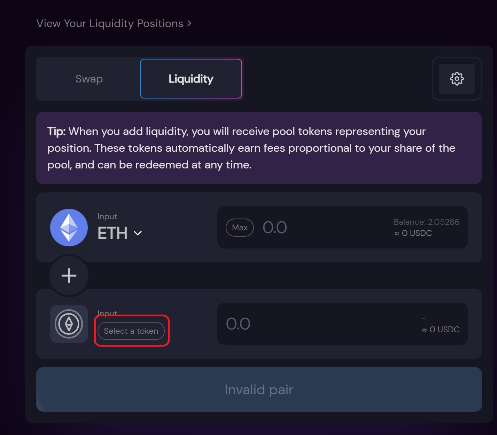
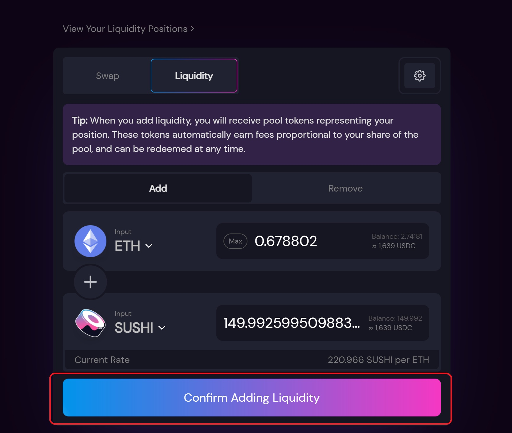
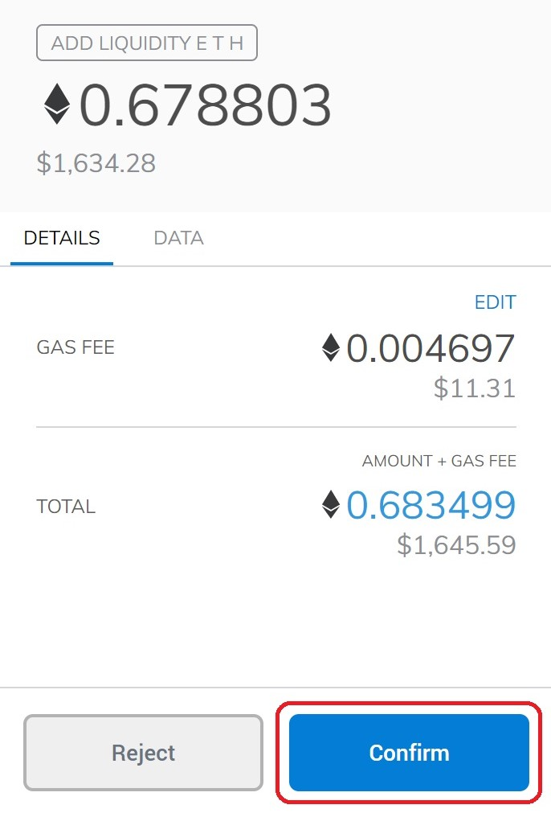
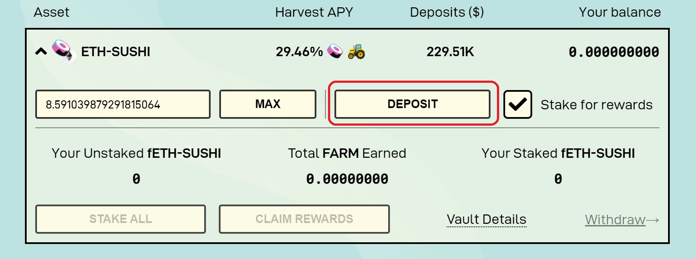
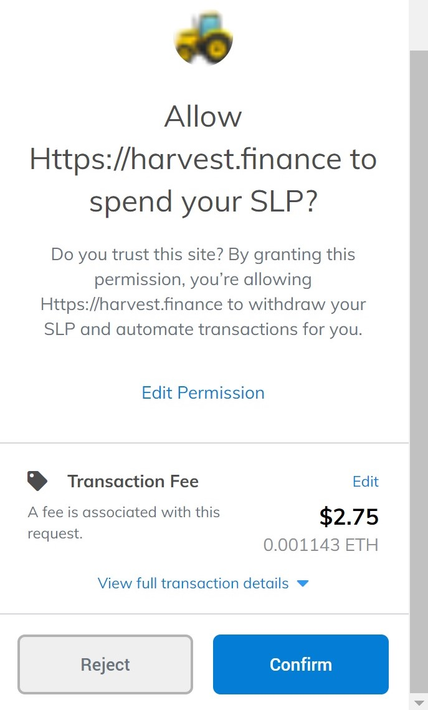
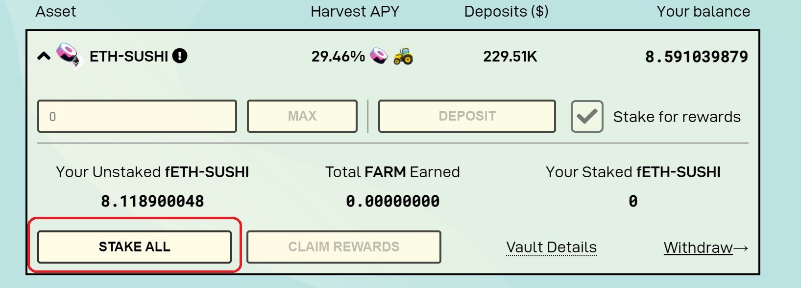
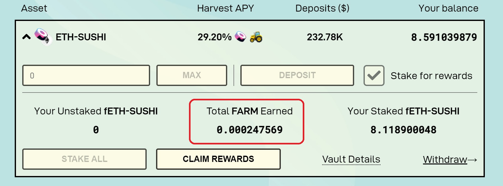

# How to deposit

## Starting 

In this tutorial I will show how to deposit and stake a Liquidity Provider position in Harvest Finance, in the exemple I'm going to proceed with Sushiswap SUSHI-ETH, but the process of providing liquidity and stake on Harvest Finance is very similar to all other LP available.   

## Sushiswap

As I have decided to specifically in this tutorial stake SUSHI-ETH on Harvest Finance, let's access Sushiswap app and start the process of providing liquidity on [Sushiswap](https://app.sushi.com/pool).

Choose Sushi to pair it with Ethereum, then select the amount of tokens you want to provide for liquidity  and proceed. 

  
After that, your Metamask will ask your permission for Sushiswap be allowed to manage the tokens provided, accept this transaction in order to proceed. After that, confirm the LP transaction.  

## Harvest Finance

After providing Liquidity on Sushiswap, let's continue on [Harvest Finance](https://harvest.finance/). Go to SUSHI/ETH pair and it will be possible to see our SUSHI/ETH SLP tokens available for deposit, click in deposit.

A transaction asking your permission for Harvest Finance manage your LP tokens will appear, confirm this transaction and  also accept the deposit transaction after that.   
  

Good, the Sushi LP is now deposited on Harvest Finance for auto compounding, but it can be even better, I can stake it and enjoy extra rewards. 

As I did in the step before, it will also be needed to confirm both permission and stake transactions  

Finally your Sushi LP is staked, auto compounding and earning FARM rewards. 

  

