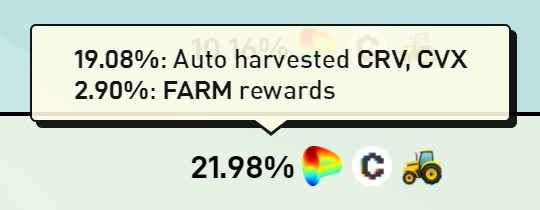
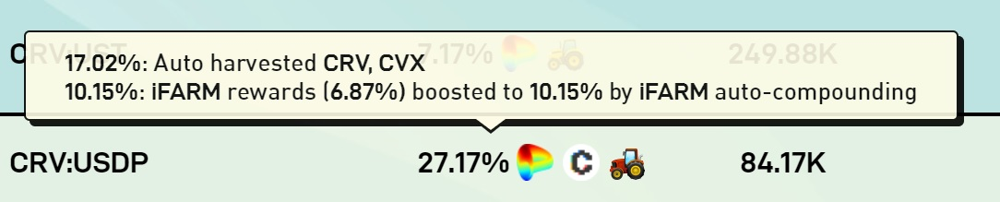
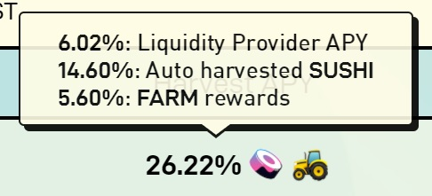
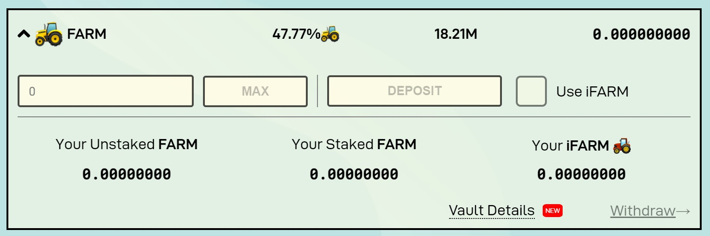

# How to understand how much you earn

## APY

Understanding how much you earn on a farming position staked on Harvest is simple, it is show explicitly on the Harvest APY column of each farmed asset. Note that each asset APY represents approximately how much your position might grow yearly, not necessarily in USD value, but in the underlying asset provided. The APY of all assets in the main page is the estimated final APY your position should grow. The 30% Profit Sharing fee is already discounted from the APY of all assets in the main page.&#x20;

## Understanding the APY composition

### Auto harvested and FARM rewards&#x20;

The APY generated by Auto harvested is the claiming of farmed asset, you are not going to receive directly the farmed asset, instead the smart contract are going to regularly sell the farming asset in order to increase your deposited position, resulting in compounded growth.&#x20;

FARM rewards are economic incentives provided by Harvest Finance. FARM token reward doesn't auto compound and need to be claimed if you want to deposit in the Profit Sharing or sell it. You can learn how to stake your positions and earn FARM rewards [here](https://harvest-finance.gitbook.io/harvest-finance/general-info/how-to-use-1/how-to-deposit-withdraw). \

### iFARM rewards

iFARM rewards automatically compounds even if iFARM are not claimed, but they need to be claimed before providing liquidity with your iFARM, withdraw from Profit Sharing or selling them.&#x20;

###

### Liquidity Provider APY

Some farming strategies are based on liquidity providing, while this strategies are subject to impermanent loss, the fees collected by LP position will also affects your position earning power.

&#x20;The Liquidity Provider APY is the approximated APY based on annualized fees and does not auto compounds as your share of the pool remains the same because every participant of the pool is equally affected by the fees collected. \

### Profit Sharing

Profit Sharing rewards are paid in FARM and they auto compounds without need to claim farmed tokens. Earned FARM tokens in the Profit Sharing Pool are automatically generating more FARM. \

You can learn more about the Profit Sharing pool [here](https://harvest-finance.gitbook.io/harvest-finance/general-info/what-do-we-do/understanding-profit-sharing). \

### Vesting

Some of the pools rewards iFARM but 2/3 of iFARM are vested for 6 months and will be available for claiming only after 6 months period.&#x20;

 (1).jpg>)

\

