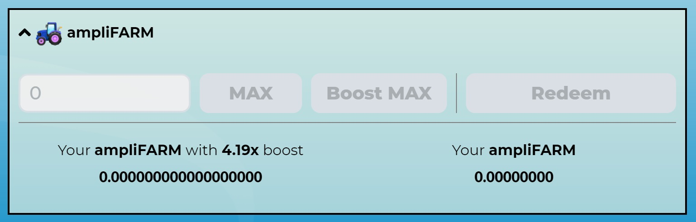
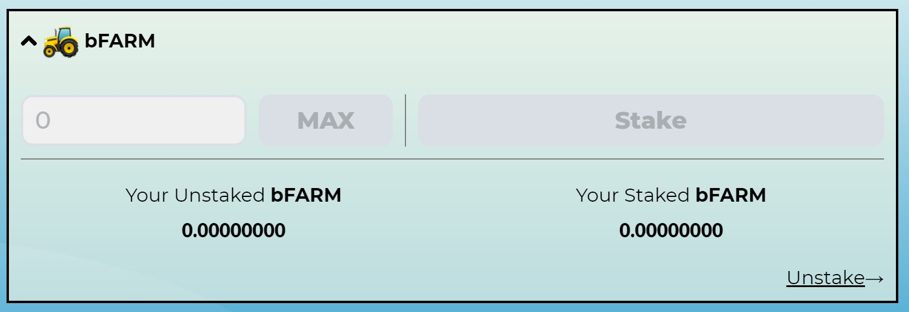

# ampliFARM

### What is ampliFARM

 ampliFARM is a token that is rewarded in some BSC pools, it can be claimed immediately at 1:1 bFARM ratio or up to 4.18x. The ampliFARM maximum amplification factor is variable over time and It grows when people redeem their ampliFARM below the maximum factor as the Farm they do not claim gets put back into the pool, becoming claimable to other ampliFARM holders.

##  How to get more bFARM from your ampliFARM

After claiming rewards from your farming pools access [ampliFARM ](https://harvest.finance/amplifarm)and stake bFARM. Staked assets will increase the factor at which ampliFARM boost raises, but remember ampliFARM boost is variable.

## Claiming

It is also possible to simply claim bFARM from ampliFARM token at 1:1 ratio if user decides to not increase the boost. 

## **The Details of $bFARM Staking**

* You stake bFARM to get ampliFARM boost.
* There is a penalty in the first 30 days, which means that boost increase will be slower during these days. During the first 30 days of staking, $bFARM isn’t earning you the boost at maximum effectiveness.
* The more $bFARM you stake, the faster you earn the boost, but remember the boost is variable over time and increases when stakers redeem their ampliFARM below the maximum factor.
* The maximum boost you can earn is x4.18.

## Resources

A very useful [ampliFARM guide](https://medium.com/harvest-finance/introducing-amplifarm-4dab54a95b41) was created by a member of Harvest Finance community. \(credits to [Just.Z](https://just-z.medium.com/)\) 

