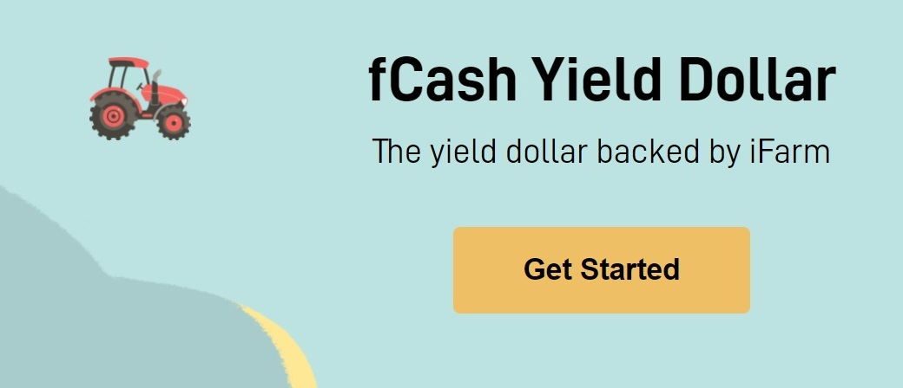
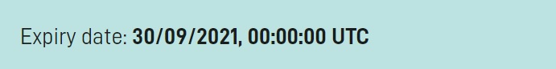
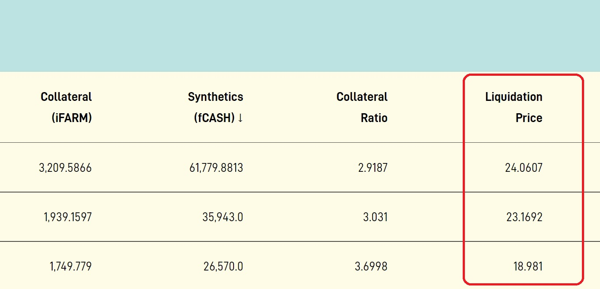

# fCASH

### What is fCASH

fCASH is a solution to leverage iFARM, essentially it works as a loan without needing to sell iFARM. iFARM holders provide iFARM to get fCASH, it can be swaped to USDC. iFARM provided as collateral can be claimed when fCASH collected is returned. 

## Expiration 

In the Expiry date each token of fCASH will expire for $1 of iFARM in the time of expiration. This mechanism gives fCASH an intrinsic value characteristic and a predictable target of value in a given date.

## Liquidation

Deposited iFARM can be liquidated if depositor fail to provide enough collateral to maintain the position. When iFARM is provided and fCASH is taken, an iFARM liquidation price is generated based on the  iFARM quantity depositor decides to provide and  fCASH decided to be taken. If iFARM price drops bellow liquidation price, any user can liquidate the under collaterized iFARM position. 

## Use fCASH

fCASH can be minted using the _creating_ action. The position can be managed in order to avoid liquidation using the _deposit_ action. To use fCASH visit [https://fcash.farmdashboard.xyz/manageposition](https://fcash.farmdashboard.xyz/manageposition)

## Resources 

An [instructive article](https://just-z.medium.com/dear-farmers-f983113873b2) about fCASH created by a community member. \(Credits to [Just.Z](https://just-z.medium.com/)\)

An [instructive article](https://www.publish0x.com/mind-puzzle/superumans-4-what-is-fcash-by-harvest-finance-xjojqor?a=pmbk1p5ezJ) about fCASH created by a community member. \(Credits to [PVMihalache](https://www.publish0x.com/@PVMihalache)\)

An [instructive infographic](https://cdn.discordapp.com/attachments/751985854641209378/857935620223270922/fCash_v3.jpg) about fCASH and many ways to use it.

