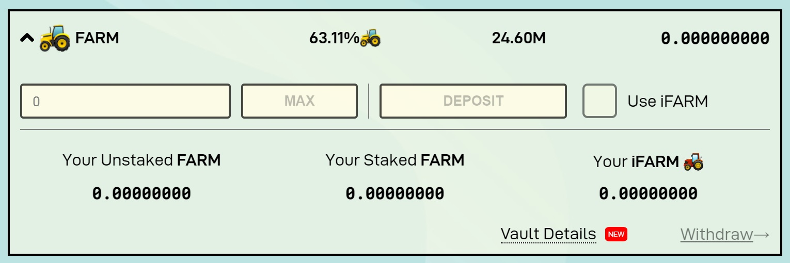
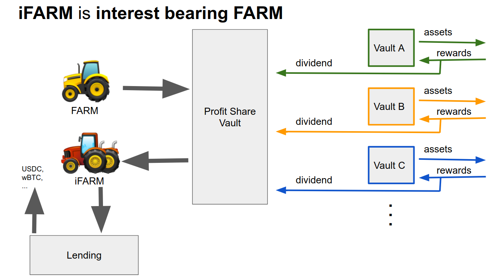

# Profit Sharing and iFARM

### Profit Sharing

A key innovation of the `$FARM` token is that it entitles holders to a performance fee \(**currently 30% ETH and 8% BSC**\) taken from Harvest's yield farming strategies. While each strategy may farm different assets, the performance fee is used to buy `$FARM` on the open market, which is then distributed to those who stake `$FARM` in the Profit Sharing pool. The price of `$FARM` is subject to consistent buy pressure as a result. To participate, users must first obtain FARM by collecting incentives for participating in Harvest's yield farming pools, or simply buying FARM directly on the open market. Then FARM must be staked in the auto-compounding Profit Sharing pool.

### Technical Details

The profit sharing pool is a modified SNX style staking pool. Once FARM is purchased on the open market it is distributed pro rata per second to all those staked in the Profit Sharing pool over a duration of 1 day, with each new reward added resetting the duration of the payout. As a result, the instantaneous reward rate for the Profit Sharing pool fluctuates over the course of the day. For this reason, a 7-day average of the reward rate is displayed for this pool. The instantaneous rate can always be checked by reading the contract directly.

### Auto Compounding

In order to rectify the observation that the FARM reward token given to our users needed to be regularly be claimed and restaked in Profit Sharing, we added an auto compounding function to the Profit Sharing pool. Whenever _any_ user deposits or withdraws funds from the Profit  Sharing pool, the rewards for _all users_ are automatically collected and restaked to improve their returns and save long term stakers gas. While this increased the cost associated with staking FARM to Profit Sharing, the utility added was deemed by our community to justify the moderate additional cost to enter or exit the pool.

### iFARM

The interest bearing FARM token, iFARM, is a deposit receipt token for FARM that is auto compounding in the Profit Sharing pool. It can be obtained by selecting the "Use iFARM" box when depositing farm into the Profit Sharing pool.

 iFARM utilizes the same [vault architecture](../../how-it-works/harvest-contracts/vaults/) as Harvest's other vaults, colleting FARM from users and then depositing it in aggregate into the Profit Sharing pool. The advantages of iFARM over FARM include:

* Lower gas costs to deposit FARM into profitsharing.
* A fungible and transferrable receipt token, iFARM, allowing compounding Profit Sharing shares to be transferred between addresses without first unstaking FARM.
* Composability of the iFARM token allows compounding Profit Sharing shares to be utilized in external opportunities, such as providing liquidity for iFARM on Matic, or minting fCASH.


Note: because there is typically some un-invested FARM in the vault, the iFARM vault has a slightly lower rate of return than FARM staked directly to profitsharing. Due to the high adoption rate of iFARM, the discrepancy is typically extremely small \(&lt;0.1% at the time of writing\).

In addition, withdraws of FARM in amounts greater than the un-invested FARM held in the vault may require more gas than withdrawing from the Profit Sharing pool directly.


## Resources

You can check how to join in the Profit Sharing pool [here](https://www.youtube.com/watch?v=VxSgvj8lmNM)  \(Credits to [Coinstruct](https://www.youtube.com/channel/UCywRgYh3qQ45savdWcY9o0A)\).  
  
You can check FARM token buybacks data, weekly profit, and FARM token PE ratio [here](https://farmdashboard.xyz/).

It is possible to check the live FARM distribution to Profit Sharing on [harvests ](https://discord.com/channels/748967094745563176/758266916095393792)Discord topic.

