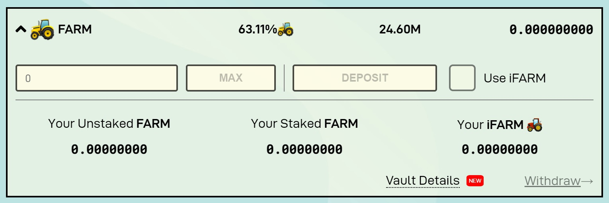
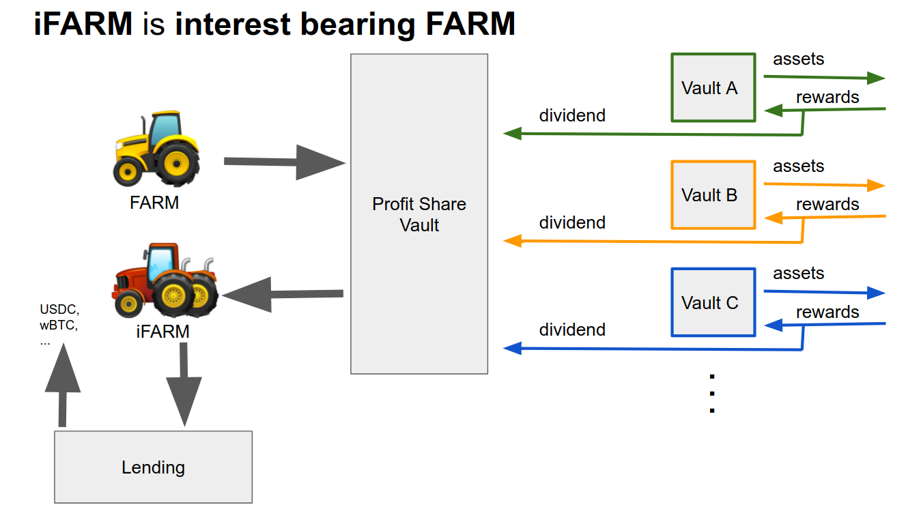

# Understanding Profit Sharing

## What is the Profit Sharing pool? 

Profit Sharing pool allows users to stake farmed FARM tokens to receive 30% of Harvest Finance protocol profits. The most popular strategies for use Profit Sharing pool is collecting FARM through regular farming of many assets available on Harvest Finance, or simply buying FARM token on the market to join the profit sharing pool.

Harvest Finance profits are regularly distributed to Profit Sharing pool through FARM token automatically bought on the market and distributed to the pool, users of the pool can expect to have their FARM tokens deposited to auto compound in the rate showed by the APY on the pool. 

## iFARM

iFARM are the Profit Sharing pool deposit receipt. The interest bearing FARM token, iFARM, is the FARM token that auto compounds at the Profit Sharing rate APY, we advise to check the "Use iFARM" box when depositing on the Profit Sharing pool, the main advantages of using iFARM is lower gas costs to deposit and withdraw FARM from Profit Sharing pool, and transferability of tokens, if user deposits in the regular Profit Sharing pool, beyond higher gas costs, FARM token is deposited and can't be transferred unless user withdraw the FARM token deposited from the pool. 

  

## Why the Profit Sharing APY goes up and down, shouldn't it be 30%?

While 30% of Harvest Finance profits are regularly distributed to the Profit Sharing pool it does not actually mean the pool APY should be 30% as Harvest Finance profits are not accumulated to be distributed immediately but distributed regularly over time, there are many reasons why APY goes up and down, it may be sometimes due to governance decisions on incentives like the amount of FARM emissions directed to Profit Sharing pool, fundamental tokenomics dynamics as the 4% emission reduction every week, or even swings in price of FARM token can deviate the short term APY from the base 30%. Market volume in LP assets farmed can also have an impact in the APY movement as a high volume in a LP position generally captures more fees driving up APY, while FARM token price could not immediately moving accordingly in the short term. Other factors that can affects Profit Sharing APY are Total Value Locked in Harvest Finance and FARM token price, generally when TVL decreases we can expect the Profit Sharing pool APY to decreases and when FARM price deviates too much from it's value we can also expect a swing in the Profit Sharing APY.

## Resources

You can check how to join in the Profit Sharing pool [here](https://www.youtube.com/watch?v=VxSgvj8lmNM)  \(Credits to [Coinstruct](https://www.youtube.com/channel/UCywRgYh3qQ45savdWcY9o0A)\).  
  
You can check FARM token buybacks data, weekly profit, and FARM token PE ratio [here](https://farmdashboard.xyz/).

It is possible to check the live FARM distribution to Profit Sharing on [harvests ](https://discord.com/channels/748967094745563176/758266916095393792)Discord topic.

