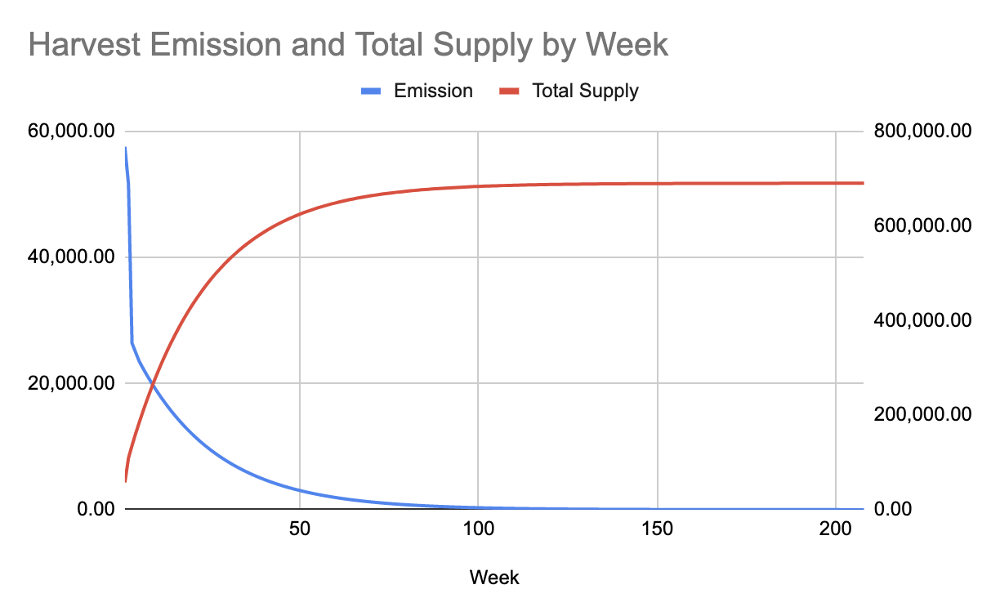

# Tokenomics, Weekly Rewards and Emission

## Emissions and Supply

In Week 5, FARM holders [voted overwhelmingly](https://snapshot.page/#/farm/proposal/QmQvoNCNhz5dARMgR82vFPeHAMPqMahHgsHjPYggFuAkGZ) to cap the maximum supply to **690,420** tokens by reducing the emissions of tokens by 4.45% every week until week 208 \(27 August 2024\) which is exactly 4 years from launch. As a result, token emissions are currently set to follow this curve:

Newly minted tokens are released **weekly** and distributed as follows:

* 70% of the FARM tokens will be distributed to capital and liquidity providers. 
* 10% of the FARM tokens will vest to the [Operational Treasury](https://etherscan.io/address/0x843002b1d545ef7abb71c716e6179570582faa40) to pay for additional development and promotion.
* 20% of the FARM tokens will vest to the [Development Team](https://etherscan.io/address/0x49d71131396f23f0bce31de80526d7c025981c4d), and are occasionally sold through tornadocash for Dev pay.

The specific weekly distribution of incentives is handled by Harvest Devs with the goal of providing the greatest benefit to FARM holders \(aligning their incentives, as Devs are paid in FARM\), and is _NOT_ subject to DAO governance votes.

## Weekly Incentives

The distribution of weekly incentives can be checked every week on [Yogafire ](https://yogafire-genuine.medium.com/)medium page, a Harvest Finance moderator.

